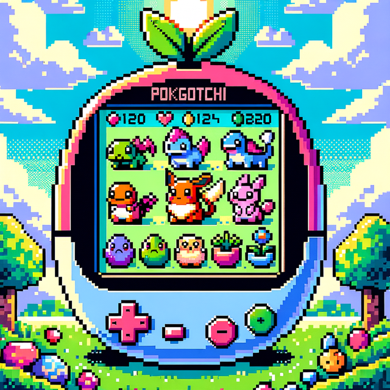

# INF-1400 Mandatory Assignment 2 - The Pokémon Care Simulator

## Introduction

In this assignment, you will build a Pokémon Care Simulator using Python and Pygame. You'll create and manage multiple Pokémon of different types and species, caring for them by dispatching actions through the user interface. Pokémon needs (nutrition, happiness, and energy) change over time based on decay rules and user interactions. Like a [Tamagotchi](https://en.wikipedia.org/wiki/Tamagotchi), the purpose is to care for your digital pets.

You deliver your codebase, a written report, and attend a 10-minute session with a TA. Using AI tools is allowed and strongly encouraged.

First, solve the base-case requirements. Then, choose 1 extension from the list and implement it. Branch out from main before starting the extension implementation so we can inspect both the base-case and extension state.

Note that no pre-code is provided in this assignment. A good place to start is creating the main.py file and write code to display an empty pygame window.

## Deadlines

The report and codebase deadline is March 20th 2026.
The following work week (23rd - 27th of March) will be used for TA sessions.

## Project requirements

### Domain model requirements (base case)

- Pokémon can be of different [types](https://pokemondb.net/type). At least three different types should be implemented (e.g., Fire, Electricity, Normal). A Pokémon instance can only be of one type at once.
- Pokémon can be of different [species](https://pokemondb.net/pokedex/all). At least three species should be available (e.g., Bulbasaur, Charizard, Pikachu). There should be no evolution between species in the simulation.
- A Pokémon instance has unique identifiers such as a nickname and an age that distinguishes it from other Pokémon of the same species.
- A Pokémon has needs: Nutrition, happiness and energy. Values are in the interval 0-100, where 100 is the highest. Needs decrease over time. Decay rates should vary (by type, species, or instance).
- Pokémon needs increase based on user actions (e.g., feed to increase nutrition).
- A Pokémon has an overall mood based on all three needs: Satisfied, Content, Neutral, Unsettled, or Critical.
- A Pokémon dies if any individual need reaches 0. It cannot be revived.

Note to the Pokémon nerds: Some of these base requirements are a breach of how the Pokémon universe works. For example the singular type
requirement, or the no-evolution requirement. These requirements are set for this assignment for a reason. See the list of extensions to
choose from further down.

### Simulation and user interface requirements

- A `main.py` file that can be run as the main entrypoint.
- Visualize each current Pokémon, for example using still images (jpeg/png) as sprites.
- Display Pokémon state (type, species, name, age, needs, mood).
- Maximum number of concurrent Pokémon (limited by GUI space).
- Visual indication when a Pokémon has died (e.g., sprite change or removal).
- Users can add more Pokémon (up to the maximum).
- Users can dispatch actions that affect Pokémon needs (e.g., feed, play, rest).
- Actions are dispatched through buttons and/or keyboard input.

### Technical requirements

**Technology stack:**

- Python (3.12 or higher)
- Pygame library for visuals/GUI
- Type hints in the code are strongly recommended

**Development tools:**

- Git for version control with upstream on GitHub Education

**Documentation:**

- `README.md` in repository root with setup instructions, dependencies, and how to run the simulation.
- Use docstrings where the code is not self-explanatory.

### OOP requirements

The code base should demonstrate appropriate use of:

- Classes, instance creation and object relations
- Inheritance between classes
- Composition
- Polymorphism
- Abstract base classes
- Encapsulation

See the assessment matrix in a separate document for evaluation criteria.

## Extensions

After solving the base-case requirements, choose 1 extension to implement. Branch out from main for the extension implementation. We need to be able to inspect the code both at the base-case and extension state. Also create a new UML Class diagram for your solution to the extension.

### 1. Evolution

Every Pokémon starts at its base evolution stage (e.g., Pichu, Charmander, Bulbasaur) and can evolve into a more advanced species when certain conditions are met.

Important decisions: the evolution condition (age-based, happiness, mood, etc.), the effects of evolution (what has changed), and whether to use the same object instance or create a new instance. Consider how this new requirement affects your class design, inheritance, and relations. For the ambitious student: Consider the factory pattern.

**Example evolution chains:**

- Pichu -> Pikachu -> Raichu
- Charmander -> Charmeleon -> Charizard
- Bulbasaur -> Ivysaur -> Venusaur

### 2. Dual types enabled for Pokémon

A Pokémon can have one or two types. For example, Bulbasaur is both Grass and Poison, while Pikachu is just Electric. Change the underlying design of classes and relations to accommodate the new requirements. What are the alternative designs? Inheritance from several Type classes? Composition? A dual-type Pokémon's decay rates and response to interactions should be influenced by both its types. The design should be implemented with extensibility in mind, so that a new brand new combination of a dual type can be added with ease.

Example of extensibility:
-> You add a Nidoking Pokémon to the simualtion. It is the first Pokémon that is both Poison and Ground type. This addition should not require substantial code changes.

### 3. Pokémon Interactions

After implementing this extension, dispatching interaction between two Pokémon should be available in the simulation. Available Pokémon interactions are: play together, share food, or compete. Interactions affect needs such as happiness and energy. Design and implement a compatibility system that determines how well two Pokémon interact. Compatibility should depend on species, type, or both.

Decide: How is compatibility determined? How do different interaction types (play, share, compete) combine with compatibility to produce changes in needs? Consider how to design this so that adding new species, types or interaction types requires minimal changes to existing code.

Note: The GUI/pygame implementation for a multi-step process of selecting 2 Pokémon for interaction is not the important part of this extension. If you get stuck on that, simplify the selection process. The user can pick 1, and the system picks the other (either at random, by highest comptatibility, by nearest location on the screen, etc.).

### 4. Wild Pokémon Encounters

Wild Pokémon occasionally appear in the simulation. To capture one, send a tame Pokémon to challenge it in a single encounter. The outcome depends on [type effectiveness](https://pokemondb.net/type) between your Pokémon's type and the wild one's type. A type advantage for the tame Pokémon means capture, and a disadvantage means the wild Pokémon flees. Regardless of the outcome, the tame Pokémon loses energy, so you need to make sure they don't die in the battle. If you capture a wild Pokémon, it joins your collection as a tame Pokémon.

Important decisions: Is a wild Pokémon a different class, a subclass, or the same class in a different state? How does it transition from wild to tame in your model? Consider how this extension affects your class hierarchy, object lifecycle, and encapsulation.

Note: Keep the number of different Pokémon types low (3-4) if you choose this extension. Programming the type compatibility system/matrix should not be the main focus. Likewise, if the pygame mechanics for random spawning of wild Pokémon becomes a blocker for your work, create a spawn button instead. The main focus should be the transition from wild to tame.

## Deliverables and assessment

Deliver a GitHub repository in GitHub Classroom containing the codebase and report. Code and report are evaluated separately. All practicalities about GitHub Classroom will be covered in class and on Canvas.

### Code and supporting information

Deliver:

- Your codebase
- A UML Class diagram (e.g., as an image file) for the base-case solution
- A `README.md` guide for TA's
- A second branch with the extension implementation + a new UML Class diagram

Note: For the codebase, the UiT AI level is 4.

### Report

Deliver `report.md` containing:

- **Design choices:**

  - **Base-case:** Explain important OOP design choices for the base-case solution. Why this design? Any alternatives?
  - **Extension:** Which extension did you choose? How did the new domain requirements change the OOP design?

- **AI reflection:**
  - Indicate which of the UiT levels from 1-4 that best descibe you AI usage in your programming work with this assignment.
  - Which AI tools did you use? Which models? How did you interact with them?
  - Example of a fruitful interaction that progressed your work
  - Example of a difficulty you experienced with an AI tool
  - How did AI tools impact your learning process?
  - What have you learned about using AI tools for software development? Any tips?
  - Your attitude towards using AI tools in future mandatory assignments? Why?
- **Misc:**
  - Best part: What are you most happy with? Why?
  - Challenge: What was the greatest challenge? Why?
  - If you had more time, what would you improve?
  - **Developer practices:** What have you learned about professional software development practices? (version control, code reviews with AI, etc.)
  - Any additional comments

Number of words:  
The total report should be somewhere between 1100 and 2000 words.  
Approximate distribution of words in the report for each of the topics above:

- 35% on **Design choices**
- 45% on **AI reflection**
- 20% on **Misc**

Note: For the report, the UiT AI level is 2, not 4. The report should not contain AI-generated text.

### Attend a TA session

You will self-select a timeslot for a 10-minute Q&A session with a TA. All practicalities about selecting timeslots will be on
Canvas.

You will be randomly assigned one of the six topics listed below. The TA will ask questions about your code related to that topic, using the assessment matrix for evaluation. The TA might turn the conversation
to related topics with follow-up questions during the 10 minute session.

- Classes, instance creation and object relations
- Inheritance between classes
- Composition
- Polymorphism
- Abstract base classes
- Encapsulation

Note: The UiT AI level for these sessions is 1.

### Assessment

Three elements are evaluated (pass/fail):

- Code repository
- Report
- TA session

You need to pass all three elements to get this mandatory assignment approved.

## Learning objectives

There are three main learning objectives for this mandatory assignment.

1. Practice applying object oriented programming principles in a larger programming project, and reflecting on possible solutions.
2. Get hands-on experience with AI tools in your computer science learning process, and reflect on how you want to use them further in your education.
3. Use professional practices: version control with git/GitHub and clear documentation for other developers.

You're going to be professional software developers one day, and we expect you to be better than the LLMs.

## Useful links

- [UML Class diagrams](https://www.geeksforgeeks.org/system-design/unified-modeling-language-uml-class-diagrams/)
- [Pokémon types](https://pokemondb.net/type)
- [All Pokémons ever](https://pokemondb.net/pokedex/all)
- You might use [Pixilart](https://www.pixilart.com/draw) if you want to draw your own pixelated sprites.
